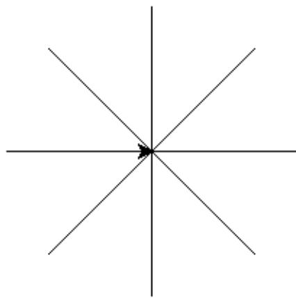

# Python 一级

2026 年 03 月

---

## 1 单选题（每题 2 分，共 30 分）

### 第 1 题

2026 年春节联欢晚会上一个武术表演节目《武 BOT》。节目中多个人形机器人会表演空翻，它们落地可能会有微微踉跄，但都会迅速调整姿态站稳，并适当移动来和前后左右的其他机器人保持原来队列。如果将机器人视作一个计算机系统，那么在该计算机系统中下面哪一项不能作为输入设备（）。

- □ A. 用于检测重心的重力传感器
- □ B. 预装的 AI 算法程序
- □ C. 接收动作指令的遥控器
- □ D. 拍摄其他机器人的摄像头

### 第 2 题

小明学习编程有一段时间了，他想在图形环境下把当前目录（或文件夹）下的文本文件 `20260314.txt` 的名字改一下。他用鼠标左键点击选中该文件后，立即完成下面哪个操作后将处于输入新文件名的状态（）。

- □ A. 单击右键并选择弹出菜单中的"重命名"
- □ B. 双击左键
- □ C. 按功能键 F1
- □ D. 按回车键

### 第 3 题

（注：原题题干在扫描件中缺失，以下题干根据选项内容推断补全）在 Python 中，关于变量名 `PI` 的相关说法，正确的是（）。

- □ A. 为了方便初学者，`print(PI)` 和 `print(pi)` 效果相同，即变量的大小写不敏感
- □ B. `print(PI)` 修改为 `print(Pi)` 能正常执行
- □ C. 不能用 `PI` 做变量名，因为要保存圆周率这个常量
- □ D. 将程序中 `PI` 全部改写为 `Pai`，将能正常执行，不会报错

### 第 4 题

Python 表达式 `3 * 3 ** 2` 的值为（）。

- □ A. 81
- □ B. 27
- □ C. 24
- □ D. 18

### 第 5 题

下面的 Python 代码执行后，其输出是（）。

```python
a, b = 3, 4
print(a + 2, b - 2)
print(a, b)
```

- □ A.

  ```text
  5 2
  3 4
  ```

- □ B.

  ```text
  5 2
  5 2
  ```

- □ C.

  ```text
  52
  34
  ```

- □ D.

  ```text
  52
  52
  ```

### 第 6 题

下面 Python 代码的相关说法，正确的是（）。

```python
N = int(input())
print(N)
```

- □ A. 执行时如输入 10，则将输出 10
- □ B. 执行时如输入 3.14，则将输出 3.14
- □ C. 执行时如输入 ABC，则将输出 0
- □ D. 执行时如输入 -10，则将输出 10

### 第 7 题

下面 Python 代码执行时，其说法正确的是（）。

```python
N = int(input())
M = int(input())
if N > M:
    print(N - M)
else:
    print(M - N)
```

- □ A. 不管输入是正数负数还是 0，其输出结果肯定是大于等于 0
- □ B. 不管是负整数、正整数亦或 0，其结果肯定是大于等于 0
- □ C. 如果 N 和 M 是相等的整数，将不会有输出
- □ D. 如果 N 和 M 输入带有小数点的数，将按整数部分计算

### 第 8 题

下面 Python 代码执行后的输出是（）。

```python
tnt = 1
for i in range(5):
    tnt *= i
print(tnt, i)
```

- □ A. 245
- □ B. 105
- □ C. 244
- □ D. 0 4

### 第 9 题

Python 编程求数列 `-1+2+3-4+5+6-7+8+9-10+11+12-13+......` 之值。如输入 4，则计算 1 到 4（包含 1 和 4）之间的值，规律如数列所示。下面说法，正确的是（）。

```python
N = int(input("请输入正整数："))
tnt = 0
for i in range(1, N + 1):
    if i % 3 == 1:
        tnt -= i
    else:
        tnt += i
print(tnt)
```

- □ A. `range(1, N + 1)` 应该修改为 `range(1, N)` 才会符合预期
- □ B. `i % 3 == 1` 应修改为 `i % 3 == 0` 才会符合预期
- □ C. `i % 3 == 1` 修改为 `i % 3` 与当前程序效果相同
- □ D. 当前代码能达到题目所描述目标

### 第 10 题

下面 Python 代码的相关说法，正确的是（）。

```python
for i in range(1, 10):
    if i % 2 == 0:
        continue
    else:
        print(i, end="#")
print(i, "END")
```

- □ A. 上述代码执行后，其输出是 `1#3#5#7#9#9END`
- □ B. 删除 `else:` 后的执行效果与当前代码相同
- □ C. 删除 `else:` 且 `print(i, end="#")` 与 `if` 对齐，则执行效果与当前代码相同
- □ D. 将 `print(i, "END")` 与 `if` 对齐，其执行效果与当前代码相同

### 第 11 题

下面的 Python 代码用于求正整数各位数之和（即数位和），约定高位不为 0，如 123 则各位数之和为 1+2+3 结果为 6。为实现该目标，横线处应该填写的代码是（）。

```python
N = int(input())
tnt = 0
while N != 0:
    ----
    ----
print("各位数字之和为：", tnt)
```

- □ A.

  ```python
  tnt += N // 10
  N // = 10
  ```

- □ B.

  ```python
  tnt += N % 10
  N // = 10
  ```

- □ C.

  ```python
  tnt += N % 10
  N /= 10
  ```

- □ D.

  ```python
  tnt = tnt + N % 10
  N /= 10
  ```

### 第 12 题

某个功能需要知道一个输入的正整数的各位数字中有多少个奇数，下面的 Python 代码是其实现，横线处应该填入的代码是（）。

```python
N = int(input())
odd_count = 0  # 记录奇数的个数
old_number = N  # 保存原数
while N != 0:
    if ____:
        odd_count += 1
    N = (N - N % 10) // 10
print(f"{old_number}中共有{odd_count}个奇数")
```

- □ A. `N % 10 % 2 == 0`
- □ B. `N % 10 % 2 == 1`
- □ C. `N // 10 // 2 == 1`
- □ D. `N // 2 // 10 == 0`

### 第 13 题

下面的 Python 执行后如果输入 8，希望输出如下图形。相关说法，正确的是（）。



```python
import turtle
N = int(input("请输入射线数量："))
Angle = 360 / N  # 计算出每条射线之间间隔的角度
for i in range(N):
    turtle.right(Angle)
    turtle.forward(100)
    turtle.goto(0, 0)
turtle.done()
```

- □ A. `Angle = 360 / N` 应该修改为 `Angle = 360 // N` 才能实现输出效果
- □ B. `range(N)` 修改为 `range(1, N + 1)` 效果相同，都能实现输出效果
- □ C. `range(N)` 修改为 `range(1, N)` 效果相同，都能实现输出效果
- □ D. `turtle.right(Angle)` 应该修正为 `turtle.right(i * Angle)` 才能达到预期效果

### 第 14 题

有关下面 Python 代码的说法，正确的是（）。

```python
import turtle
turtle.forward(100)
turtle.left(90)
turtle.forward(100)
turtle.goto(0, 0)
turtle.done()
```

- □ A. 代码执行后，将输出等腰直角三角形
- □ B. 代码执行后，将输出等长的两条边，其夹角为 90 度，因为没有画出斜边，因此不是三角形
- □ C. 代码执行后，90 度夹角位于原点
- □ D. 因为没有执行 `turtle.pendown()`，所以不会画出图形

### 第 15 题

在 Python 中，`turtle.write()` 用于在当前坐标处输出文字。下面说法，错误的是（）。

```python
import turtle
for i in range(1, 10):
    turtle.write(f"{i}+{i}={i*2}")
    turtle.goto(i * 40, 0)
turtle.done()
```

- □ A. `1+1=2` 输出在坐标原点，即 (0, 0)
- □ B. `1+1=2` 的起点与 `2+2=4` 的起点间隔 40 个像素
- □ C. 最后输出是 `10+10=20`
- □ D. `1+1=2` 等输出文字的下面将有一条直线

---

## 2 判断题（每题 2 分，共 20 分）

### 第 1 题

小明的妈妈最近刚刚给他买了一块电话手表，除了可以看时间，小明也可以用它和妈妈打电话、收发信息，那么可以推测这块手表中装有一款特定操作系统。（）

### 第 2 题

Python 表达式 `4 ** 2` 和 `2 * 2 ** 2` 的结果相同。（）

### 第 3 题

下面 Python 代码执行后将输出 0。（）

```python
for i in range(1, 10):
    if i % 3 == 0:
        break
print(i)
```

### 第 4 题

下面 Python 代码用于求 1 到 N 之和，N 为正整数。因为 `range(1, N + 1)` 中包含 N，因此是 1 到 N 且包含 N 之和。（）

```python
N = int(input("请输入正整数："))
total = 0
for i in range(1, N + 1):
    total += i
print(total)
```

### 第 5 题

执行下面的 Python 代码，其语句 `print(N)` 将被执行 0 次或无数次（即死循环）。（）

```python
N = input()
while N:
    print(N)
```

### 第 6 题

下面的 Python 代码能实现判断输入的正整数是否为对称数。所谓对称数是指从左到右和从右到左读该数，其值相同，如 121 或 414 等是对称数，而 123 不是对称数。（）

```python
n = int(input("请输入正整数:"))
old_number = n
new_number = 0
while n != 0:
    new_number = new_number * 10 + n % 10
    n // = 10

if old_number == new_number:
    print("对称数")
else:
    print("非对称数")
```

### 第 7 题

执行下面的 Python 代码，如果输入为大于 0 的整数，则输出一定为 0。（）

```python
N = int(input())
total = 0
for i in range(-N, N, 2):
    total += i
print(total)
```

### 第 8 题

执行 Python 语句 `print(int(3.14))` 将报错。（）

### 第 9 题

下面的 Python 代码执行后，将输出等边三角形。（）

```python
import turtle
turtle.circle(50, steps=3)
turtle.done()
```

### 第 10 题

下面的 Python 代码执行后第一条直线与第二条直线相交于原点，两线之间的夹角为 120 度。（）

```python
import turtle
turtle.forward(100)
turtle.right(60)
turtle.forward(100)
turtle.right(60)
turtle.forward(100)
turtle.done()
```

---

## 3 编程题（每题 25 分，共 50 分）

### 3.1 编程题 1：交朋友

- 试题名称：交朋友
- 时间限制：1.0 s
- 内存限制：512.0 MB

#### 题目描述

Alice 班上共有 4 个小朋友，身高分别为 H₁、H₂、H₃、H₄，其中 Alice 的身高为 H₁。

Alice 想要和身高最接近她的人交朋友，如果有多个人符合条件，则 Alice 想和其中较矮的那一人做朋友，你能告诉她这个人的身高是多少吗？

#### 输入格式

输入共 4 行，第 i 行包含一个整数 Hᵢ，表示班上小朋友的身高。

#### 输出格式

输出 1 行，包含一个整数，表示 Alice 想交的朋友的身高。

#### 样例

**输入样例 1**

```text
150
165
135
133
```

**输出样例 1**

```text
135
```

**样例解释 1**

样例 1 中，Alice 身高为 150，第 2、3 个小朋友与 Alice 身高差距为 15，同样最接近，Alice 选较矮的一个即第 3 个身高为 135 的小朋友交朋友。

#### 数据范围

保证 100 ≤ Hᵢ ≤ 199 且 Hᵢ 互不相同。

#### 参考程序

```python
# 读入4个小朋友的身高
H1 = int(input())  # Alice 的身高
H2 = int(input())
H3 = int(input())
H4 = int(input())

# 我们只关心 H2, H3, H4 (其他三个小朋友)

# 先算出每个人和 Alice 的身高差（用绝对值，这样不会负数）

# 与H2小朋友的身高差
# 如果身高差为负数，转换为正数。
diff2 = H2 - H1
if diff2 < 0:
    diff2 = -diff2

# 与H3小朋友的身高差
diff3 = H3 - H1
if diff3 < 0:
    diff3 = -diff3

# 与H4小朋友的身高差
diff4 = H4 - H1
if diff4 < 0:
    diff4 = -diff4

# 刚开始假设最好的朋友是 H2
best = H2  # 最好的小朋友身高，
best_diff = diff2  # 与最好小朋友的身高差

# 比较 H3 小朋友
if diff3 < best_diff:  # 如果 H3 更接近，即身高差更小
    best = H3  # 最好小朋友的身高进行更新
    best_diff = diff3  # 与最好小朋友的身高差更新
elif diff3 == best_diff and H3 < best:  # 如果一样近，但 H3 小朋友更矮
    best = H3

# 比较 H4
if diff4 < best_diff:    # 如果 H4 更接近
    best = H4  # 最好小朋友的身高进行更新
    best_diff = diff4  # 与最好小朋友的身高差更新
elif diff4 == best_diff and H4 < best:  # 如果一样近，但 H4 更矮
    best = H4

# 输出结果，即输出最好小朋友的身高
print(best)
```

### 3.2 编程题 2：数字替换

- 试题名称：数字替换
- 时间限制：1.0 s
- 内存限制：512.0 MB

#### 题目描述

Alice 不喜欢数字 4，但觉得数字 8 寓意好，她想把数中的 4 全都替换成 8，若数中不含 4 则无需修改，你能帮帮她吗？

#### 输入格式

输入一行，包含一个整数 A，表示替换前的数。

#### 输出格式

输出一行，包含一个整数，表示替换后的数。

#### 样例

**输入样例 1**

```text
8459045
```

**输出样例 1**

```text
8859085
```

**输入样例 2**

```text
123
```

**输出样例 2**

```text
123
```

**样例解释**

对于样例 1，输入 8459045 中有两个 4，都将其替换为了 8，得到 8859085。

对于样例 2，输入 123 中不包含 4，无需修改输入数字，输出 123。

#### 数据范围

0 ≤ A ≤ 10^8。

#### 参考程序

```python
num = int(input())  # num保存输入的数
new_num = 0  # 4被替换为8的新数
loop_count = 0  # 循环次数
times = 10 ** loop_count  # 根据循环次数决定是10的多少次方
while num > 0:
    if num % 10 == 4:  # 如果余数是4，也就是该位置为4
        new_num += times * 8  # 变成8乘以多少次方
    else:
        new_num += times * (num % 10)  # 用原数乘以多少次方
    num // = 10
    loop_count += 1  # 循环次数+1，相当于向前一位
    times = 10 ** loop_count  # 根据循环次数决定是10的多少次方
print(new_num)  # 输出新的数
```
