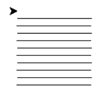

# Python 一级

2026 年 06 月

---

## 1 单选题（每题 2 分，共 30 分）

### 第 1 题

学校组织同学们到未来农场参观，小明听讲解员介绍。在智能温室中，湿度传感器可以连续检测土壤的湿度，并将检测到的湿度数据实时发送给中央控制器。中央控制器根据这些数据判断是否开启灌溉系统。请问，这里的湿度传感器所发挥的作用，类似于计算机系统中的哪一类组件？（）

- □ A. 处理器
- □ B. 存储器
- □ C. 输入设备
- □ D. 输出设备

### 第 2 题

在使用某集成开发环境（比如 Python IDLE、PyCharm）来编辑源代码文件时，程序员经常需要在编辑区中对代码进行各种修改。以下关于在编辑区中执行的操作，描述不正确的是（）。

- □ A. 可以将变量名 count 统一修改为 number
- □ B. 可以连续撤销最近 2 次输入的内容
- □ C. 可以调整代码行的缩进（如按 Tab 键）
- □ D. 在注释文本中间不能混用中英文

### 第 3 题

有关如下 Python 代码的说法，正确的是（）。

```python
a = 3 + 3.5
print(a)
```

- □ A. 代码执行将报错。如果将 `a = 3 + 3.5` 改为 `a = float(3) + 3.5` 将能正常执行。
- □ B. 代码执行将报错。如果将 `a = 3 + 3.5` 改为 `a = 3.0 + 3.5` 将能正常执行。
- □ C. 代码能正常执行，将输出 6。
- □ D. 代码能正常执行，将输出 6.5。

### 第 4 题

下列 Python 表达式与 `-2 * 2 ** 4` 的值相同的是（）。

- □ A. `- (2 * 2) ** 4`
- □ B. `(-2 * 2) ** 4`
- □ C. `- 2 * (2 ** 4)`
- □ D. `(2 * 2) ** - 4`

### 第 5 题

如下 Python 代码执行后，其输出是（）。

```python
a = 3
b = a
a = 4
print(a, b)
```

- □ A. 3 3
- □ B. 4 3
- □ C. 4 4
- □ D. 3 4

### 第 6 题

如下 Python 代码执行时输入 `2026-6-27`，下列说法正确的是（）。

```python
N = input()
print(N)
```

- □ A. 输入失败，不允许输入减号，没有输出
- □ B. 允许输入，输出 1993
- □ C. 允许输入并原样输出 2026-6-27
- □ D. 允许输入并输出 '2026-6-27'【注：两侧有英文单引号】

### 第 7 题

如下 Python 代码执行时，下列说法错误的是（）。

```python
N = int(input())
M = int(input())
if N > M:
    print("A", N - M)
else:
    print("B", M - N)
```

- □ A. 如果先后输入 4 和 3，将输出 A 1
- □ B. 如果先后输入 3 和 4，将输出 B 1
- □ C. 如果先后输入 3 和 3，将输出 A 0
- □ D. 如果先后输入 4 和 4，将输出 B 0

### 第 8 题

阅读如下 Python 代码，下列说法错误的是（）。

```python
cnt = 0
for i in range(5):
    cnt += 1
print(cnt)
```

- □ A. 将 `cnt += 1` 修改为 `cnt = cnt + 1`，执行效果相同
- □ B. 将 `cnt += 1` 修改为 `cnt = 1 + cnt`，执行效果相同
- □ C. 将 `cnt += 1` 修改为 `cnt = +1`，执行效果相同
- □ D. 将 `cnt += 1` 修改为 `cnt = +1 + cnt`，执行效果相同

### 第 9 题

如下 Python 代码横线处应填入的运算符依次是（）。

```python
num = 1
for i in range(35):
    print(num, end=" ")
    if num ____ 10:
        num ____ 2
    else:
        num ____ 1
```

- □ A. `> // = +=`
- □ B. `>= // = +=`
- □ C. `> / = +=`
- □ D. `> // = +=`

### 第 10 题

如下 Python 代码执行，其输出是（）。

```python
for i in range(1, 5):
    if i % 2 == 0:
        continue
    print(i, end="#")
print(i, "END", end="#")
```

- □ A. 4END#
- □ B. 5#END
- □ C. 1#3#4#END
- □ D. 1#3#4 END#

### 第 11 题

如下 Python 代码执行时，下列说法正确的是（）。

```python
N = int(input())
for i in range(2, N):
    if N % i == 0:
        print(1, end="#")
        break
    else:
        print(0, end="#")
```

- □ A. 如果输入 2，将输出 1#。
- □ B. 如果输入 15，将输出 0#1#。
- □ C. 如果输入 1，将输出 0#。
- □ D. 如果输入 3，将输出 1#。

### 第 12 题

下列说法有关如下 Python 代码，错误的是（）。

```python
i = 0
tot = 0
while 0 <= i < 10:
    tot += i
    i += 1
print(tot)
```

- □ A. 如果调整 `0 <= i < 10` 为 `1 <= i < 10`，输出同样为 45，因为加上 0 不影响结果。
- □ B. 如果将 `i = 0` 和 `tot = 0` 合并为 `i, tot = 0, 0`，执行结果与修改前相同。
- □ C. 将 `tot += i` 与 `i += 1` 交换顺序，执行结果与修改前不同。
- □ D. 将 `i = 0` 与 `tot = 0` 交换顺序，执行结果与修改前相同。

### 第 13 题

如下 Python 代码执行后，下列说法正确的是（）。

```python
import turtle
turtle.circle(50)
turtle.done()
```

- □ A. 画一个半径为 50 的实心圆
- □ B. 画一个直径为 50 的圆
- □ C. 画一个半径为 50 的空心圆
- □ D. 画一个边长为 50 的正方形

### 第 14 题

如下 Python 代码用于画一个边长为 100 的正方形，横线处应填入的代码是（）。

```python
import turtle
for i in range(4):
    ----
    ----
turtle.done()
```

- □ A.

  ```python
  turtle.forward(100)
  turtle.left(90)
  ```

- □ B.

  ```python
  turtle.forward(100)
  turtle.left(180)
  ```

- □ C.

  ```python
  turtle.forward(100)
  turtle.right(180)
  ```

- □ D.

  ```python
  turtle.forward(100)
  turtle.left(45)
  ```

### 第 15 题

要实现如下图所示的执行效果，横线处分别应填入的代码是（）。



```python
import turtle
for i in range(10):
    if i % 2 == 0:
        ----
        turtle.penup()
        turtle.goto(100, (i + 1) * 10)
    else:
        ----
        turtle.penup()
        turtle.goto(0, (i + 1) * 10)
        turtle.pendown()
turtle.done()
```

- □ A.

  ```python
  turtle.goto(100, i * 10)
  turtle.goto(100, i * 10)
  ```

- □ B.

  ```python
  turtle.goto(100, i * 10)
  turtle.goto(0, i * 10)
  ```

- □ C.

  ```python
  turtle.goto(0, i * 10)
  turtle.goto(0, i * 10)
  ```

- □ D.

  ```python
  turtle.goto(0, i * 10)
  turtle.goto(100, i * 10)
  ```

---

## 2 判断题（每题 2 分，共 20 分）

### 第 1 题

又到期末考试周，小明发现这次许多闭卷考试不仅禁止携带手机、平板电脑，还有最近比较时髦的各类 AI 眼镜（也有叫智能眼镜）也同样不允许带入考场。这些 AI 眼镜应该也是内置了操作系统并可能支持 Wi-Fi 或蓝牙连接。（）

### 第 2 题

如果 `n` 为大于 100 的整数，则 Python 表达式 `(n // 10) % 10` 与 `(n % 100) // 10` 的结果相同。（）

### 第 3 题

下面 Python 代码执行后将输出 19。（）

```python
for i in range(0, 20, 3):
    if i % 3 != 0:
        break
print(i)
```

### 第 4 题

在数学中，`N!` 称之为 `N` 的阶乘，其含义是 1 到 `N` 之积，包括 `N`。如 `3! = 1 × 2 × 3 = 6`。如下 Python 代码能输出 `N!` 的结果。（）

```python
N = int(input("请输入正整数："))
rst = 0
for i in range(1, N + 1):
    rst *= i
print(rst)
```

### 第 5 题

如下 Python 代码能实现输出正整数 `N` 的各位数字。（）

```python
N = int(input())
while N > 0:
    print(N % 10)
    N = N / 10
```

### 第 6 题

将如下 Python 代码中的 `print()` 更换为 `print("")`，输出效果相同。（）

```python
for i in range(0, 100):
    if i % 5 == 0:
        print()
print(f"{i:2}", end=" ")
```

### 第 7 题

执行 Python 代码 `print(2.5 % 2)` 时不会报错。（）

### 第 8 题

执行 Python 语句 `print(int(3.5) * 2)` 将输出 6。（）

### 第 9 题

在 Python turtle 编程中，`turtle.speed(0)` 最慢，`turtle.speed(10)` 最快。（）

### 第 10 题

在 Python turtle 编程中，调用 `turtle.clear()` 后，画布上的所有图形会被清除，且海龟会自动回到屏幕中心（原点），朝向也重置为默认的向右（0 度）。（）

---

## 3 编程题（每题 25 分，共 50 分）

### 3.1 编程题 1：去旅行

- 试题名称：去旅行
- 时间限制：1.0 s
- 内存限制：512.0 MB

#### 题目描述

快暑假了，小杨同学正在计划出去旅行，前往目的地的方案多种多样，小杨同学想知道如何前往目的地最便宜。

小杨同学住在 A 市，旅行目的地是 B 市，小杨同学前往目的地有三种方案：

1. 从 A 市直飞 B 市；
2. 从 A 市坐高铁到 C 市，然后坐飞机到 B 市；
3. 从 A 市坐高铁到 C 市，然后坐高铁到 B 市。

请帮小杨同学求出最便宜的出行方案的价格。

#### 输入格式

输入包含 4 行，每行一个正整数：

- 第 1 行的正整数表示「从 A 市直飞 B 市」的价格；
- 第 2 行的正整数表示「从 A 市坐高铁到 C 市」的价格；
- 第 3 行的正整数表示「从 C 市坐飞机到 B 市」的价格；
- 第 4 行的正整数表示「从 C 市坐高铁到 B 市」的价格。

#### 输出格式

输出一个正整数，表示 3 种方式中，最便宜的出行方案的价格。

#### 样例

**输入样例 1**

```text
999
105
699
588
```

**输出样例 1**

```text
693
```

**样例解释 1**

- 方案 1. 直飞价格为 999；
- 方案 2. 高铁转飞机价格为 105 + 699 = 804；
- 方案 3. 高铁的价格为 105 + 588 = 693；

因此最便宜的价格是 693。

**输入样例 2**

```text
9
3
8
7
```

**输出样例 2**

```text
9
```

**样例解释 2**

- 方案 1. 直飞价格为 9；
- 方案 2. 高铁转飞机价格为 3 + 8 = 11；
- 方案 3. 高铁的价格为 3 + 7 = 10；

因此最便宜的价格是 9。

#### 数据范围

所有输入均为正整数，且不超过 10000。

#### 参考程序

```python
# 读取第1个数据：从A市直飞B市的价格
a = int(input())
# 读取第2个数据：从A市坐高铁到C市的价格
b = int(input())
# 读取第3个数据：从C市坐飞机到B市的价格
c = int(input())
# 读取第4个数据：从C市坐高铁到B市的价格
d = int(input())
# 计算方案1的总价格：A市 直飞 B市
price1 = a

# 计算方案2的总价格：A市高铁到C市，再飞机到B市
price2 = b + c

# 计算方案3的总价格：A市高铁到C市，再高铁到B市
price3 = b + d

# 先假设方案1是最便宜的（打擂台思想）
min_price = price1

# 如果方案2比当前最便宜的价格还低，就更新最小值
if price2 < min_price:
    min_price = price2

# 如果方案3比当前最便宜的价格还低，就更新最小值
if price3 < min_price:
    min_price = price3

# 输出三种方案中最便宜的出行价格
print(min_price)
```

### 3.2 编程题 2：交税

- 试题名称：交税
- 时间限制：1.0 s
- 内存限制：512.0 MB

#### 题目描述

根据国家税收相关规定，劳务报酬需要按月预交个税，预交税率如下：

1. 劳务报酬不超过 800 的，不需要预交个税；
2. 劳务报酬超过 800 的，仅超过 800 的部分按照 20%（即 0.2）税率预交个税（不超过 800 的部分不需要预交个税）；

例如，月劳务报酬为 1000.0，则按照规则 2 需要预交个税 `(1000.0 − 800.0) × 20% = 40.00`。

现在给定小杨同学 12 个月的月度劳务报酬，请帮小杨同学计算他这 12 个月应预交个税的总和。

#### 输入格式

输入 12 行，每行一个浮点数，表示小杨同学 12 个月中每个月的劳务报酬。

每个浮点数恰好有一位小数。

#### 输出格式

输出 1 行，一个浮点数，保留两位小数，表示小杨同学 12 个月应预交个税的总和。

#### 样例

**输入样例 1**

```text
932.0
1634.3
1790.4
2172.9
378.1
283.4
2761.9
3583.5
10.1
2324.9
1111.6
3812.3
```

**输出样例 1**

```text
2584.76
```

**样例解释 1**

1. 932.0 符合规则 2，超过 800 的部分为 132.0，按照 20% 预交为 132.0 × 20% = 26.40；
2. 1634.3 符合规则 2，超过 800 的部分为 834.3，按照 20% 预交为 834.3 × 20% = 166.86；
3. 1790.4 符合规则 2，超过 800 的部分为 990.4，按照 20% 预交为 990.4 × 20% = 198.08；
4. 2172.9 符合规则 2，超过 800 的部分为 1372.9，按照 20% 预交为 1372.9 × 20% = 274.58；
5. 378.1 符合规则 1，不需要预交个税；
6. 283.4 符合规则 1，不需要预交个税；
7. 2761.9 符合规则 2，超过 800 的部分为 1961.9，按照 20% 预交为 1961.9 × 20% = 392.38；
8. 3583.5 符合规则 2，超过 800 的部分为 2783.5，按照 20% 预交为 2783.5 × 20% = 556.70；
9. 10.1 符合规则 1，不需要预交个税；
10. 2324.9 符合规则 2，超过 800 的部分为 1524.9，按照 20% 预交为 1524.9 × 20% = 304.98；
11. 1111.6 符合规则 2，超过 800 的部分为 311.6，按照 20% 预交为 311.6 × 20% = 62.32；
12. 3812.3 符合规则 2，超过 800 的部分为 3012.3，按照 20% 预交为 3012.3 × 20% = 602.46；

各项相加总和为 2584.76。

#### 数据范围

小杨同学每月劳务报酬收入均为正，且恰好有一位小数，且不超过 4000.0。

#### 参考程序

```python
# 总的税额
ans = 0.0

# for循环遍历12个月的收入
for _ in range(12):
    a = float(input())
    # 分支语句，判断800以下和800以上的个税额度
    if a <= 800.0:
        ans += 0.0  # 800以下不用交税
    else:
        b = (a - 800.0) * 0.2  # 800以上的部分缴纳20%的个税
        ans += b

print(f'{ans:.2f}')  # 最终的结果
```
