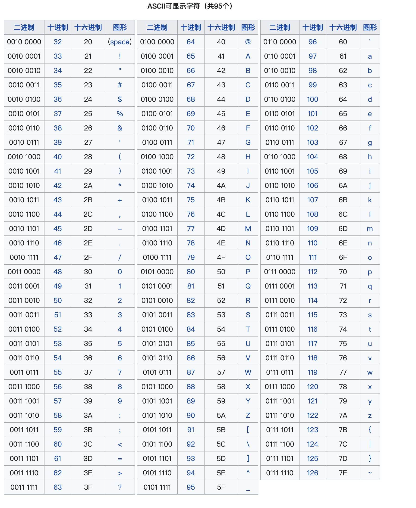
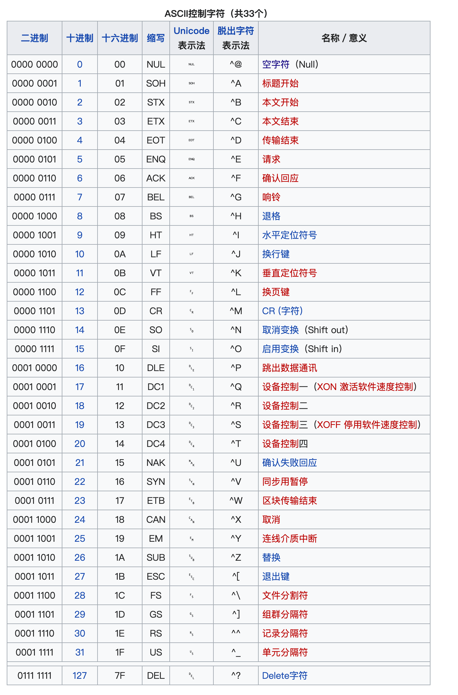

## 字符编码基础：ASCII 与 Unicode

### 1. ASCII 编码

**定义**  
ASCII（American Standard Code for Information Interchange）是基于拉丁字母的字符编码系统，主要用于表示现代英语字符。其扩展版本支持部分西欧语言，并与国际标准 ISO/IEC 646 等同。

**本质**  
ASCII 是一张数字（码点）与字符的映射表，计算机通过该映射将二进制数据转换为可读文本。

**常用码点范围**

| 字符集  | 十进制范围 |
| ------- | ---------- |
| 'A'–'Z' | 65–90      |
| 'a'–'z' | 97–122     |
| '0'–'9' | 48–57      |

**Python 内置函数**

- `ord(char)`：返回字符的 Unicode 码点（ASCII 码点与 Unicode 一致）。
- `chr(code)`：返回码点对应的字符。

示例：
```python
print(ord("A"))  # 65
print(chr(65))   # A
```

**ASCII 码表参考图**  





---

### 2. Unicode 编码

**背景**  
ASCII 仅能表示 128 个字符，无法支持中文、日文、韩文等文字。Unicode 为全球所有字符分配唯一的码点，实现多语言统一编码。

**实现方式**  
Unicode 是字符集，其存储实现包括 UTF-8、UTF-16、UTF-32。其中 UTF-8 为变长编码（1~4 字节），且兼容 ASCII（前 128 个码点与 ASCII 相同）。

**与 ASCII 的关系**  
Unicode 完全包含 ASCII，即 `'A'` 的码点始终为 65，编码后仍为单字节。

**对比总结**

| 特性     | ASCII          | Unicode       |
| -------- | -------------- | ------------- |
| 字符覆盖 | 英文及控制字符 | 全球所有文字  |
| 编码长度 | 固定 1 字节    | 变长（UTF-8） |
| 兼容性   | 仅英文         | 兼容 ASCII    |
| 应用场景 | 纯英文环境     | 国际化应用    |

---

### 3. Python 常用编码相关函数

#### 3.1 `ord()` 与 `chr()`

- `ord(char)` → int  
- `chr(code)` → str  

```python
print(ord("中"))   # 20013
print(chr(20013))  # 中
```

#### 3.2 `str.encode()` 与 `bytes.decode()`

- `encode(encoding='utf-8')`：字符串 → 字节序列（bytes）
- `decode(encoding='utf-8')`：字节序列 → 字符串

```python
s = "你好"
b = s.encode("utf-8")        # b'\xe4\xbd\xa0\xe5\xa5\xbd'
s2 = b.decode("utf-8")       # "你好"
```

编码与解码必须使用相同编码方案，否则引发 `UnicodeDecodeError` 或乱码。

#### 3.3 `bytes()` 与 `bytearray()`

- `bytes([int, ...])`：创建不可变字节序列
- `bytearray([int, ...])`：创建可变字节序列

```python
b = bytes([65, 66, 67])      # b'ABC'
ba = bytearray([97, 98, 99]) # bytearray(b'abc')
ba[0] = 100                  # 可修改
```

#### 3.4 `bytes.hex()`

将字节序列转换为十六进制字符串，便于查看原始编码。

```python
b = "Hello".encode("utf-8")
print(b.hex())   # 48656c6c6f
```

#### 3.5 `int.to_bytes()` 与 `int.from_bytes()`

用于整数（码点）与字节序列的互转，需指定字节数和字节序。

```python
# 整数 → 字节（大端，2字节）
b = (20013).to_bytes(2, byteorder='big')   # b'\x4e\x2d'
# 字节 → 整数
num = int.from_bytes(b, byteorder='big')   # 20013
print(chr(num))                            # 中
```

---

### 4. 函数适用场景速查

| 操作目标               | 使用函数/方法                         |
| ---------------------- | ------------------------------------- |
| 获取字符码点           | `ord(char)`                           |
| 根据码点获取字符       | `chr(code)`                           |
| 字符串编码为字节       | `s.encode(enc)`                       |
| 字节解码为字符串       | `b.decode(enc)`                       |
| 查看字节十六进制       | `b.hex()`                             |
| 创建/操作可变字节      | `bytearray`                           |
| 整数与字节互转（底层） | `int.to_bytes()` / `int.from_bytes()` |
