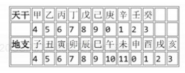

# CSP-J 2020

## 一、单项选择题（共15题，每题2分，共计30分）

**1.（2分）** 在内存储器中每个存储单元都被赋予一个唯一的序号，称为（ ）
A. 下标
B. 地址
C. 序号
D. 编号

**2.（2分）** 编译器的主要功能是（ ）
A. 将源程序翻译成机器指令代码
B. 将一种高级语言翻译成另一种高级语言
C. 将源程序重新组合
D. 将低级语言翻译成高级语言

**3.（2分）** 设x=true, y=true, z=false，以下逻辑运算表达式值为真的是（ ）
A. (x∧y) ∧z
B. x∧(z∨y) ∧z
C. (x∧y)∨(z∨x)
D. (y∨z)∧x∧z

**4.（2分）** 现有一张分辨率为2048×1024像素的32位真彩色图像。请问要存储这张图像，需要多大的存储空间？（ ）
A. 4MB
B. 8MB
C. 32MB
D. 16MB

**5.（2分）** 冒泡排序算法的伪代码如下：

```
输入：数组L, n ≥ 1。输出：按非递减顺序排序的L
算法 BubbleSort：
  1. FLAG ← n //标记被交换的最后元素位置
  2. while FLAG > 1 do
  3.     k ← FLAG - 1
  4.     FLAG ← 1
  5.     for j = 1 to k do
  6.         if L(j) > L(j+1) then do
  7.             L(j) ↔ L(j+1)
  8.             FLAG ← j
```

对n个数用以上冒泡排序算法进行排序，最少需要比较多少次？（ ）
A. n
B. n-2
C. n²
D. n-1

**6.（2分）** 设A是n个实数的数组，考虑下面的递归算法：

```
XYZ (A[1..n])
1. if n=1 then return A[1]
2. else temp ← XYZ (A[1..n-1])
3.      if temp < A[n]
4.          then return temp
5.          else return A[n]
```

请问算法XYZ的输出是什么？（ ）
A. A数组的平均
B. A数组的最小值
C. A数组的最大值
D. A数组的中值

**7.（2分）** 链表不具有的特点是（ ）
A. 插入删除不需要移动元素
B. 可随机访问任一元素
C. 不必事先估计存储空间
D. 所需空间与线性表长度成正比

**8.（2分）** 有10个顶点的无向图至少应该有（ ）条边才能确保是一个连通图。
A. 10
B. 12
C. 9
D. 11

**9.（2分）** 二进制数1011转换成十进制数是（ ）
A. 10
B. 13
C. 11
D. 12

**10.（2分）** 五个小朋友并排站成一列，其中有两个小朋友是双胞胎，如果要求这两个双胞胎必须相邻，则有（ ）种不同排列方法？
A. 24
B. 36
C. 72
D. 48

**11.（2分）** 下图中所使用的数据结构是（ ）

```
  ┌───┐          ┌───┐         ┌───┐          ┌───┐         ┌───┐
  │   │          │   │         │   │          │   │         │   │   
  ├───┤          ├───┤         ├───┤          ├───┤         ├───┤
  │   │ =》压入A  │   │ =》压入B │ B │ =》弹出B  │   │=》压入C  │ c │
  ├───┤          ├───┤         ├───┤          ├───┤         ├───┤  
  │   │          │ A │         │ A │          │ A │         │ A │
  └───┘          └───┘         └───┘          └───┘         └───┘
```

A. 哈希表
B. 二叉树
C. 栈
D. 队列

**12.（2分）** 独根树的高度为1。具有61个结点的完全二叉树的高度为（ ）
A. 7
B. 5
C. 8
D. 6

**13.（2分）** 干支纪年法是中国传统的纪年方法，由10个天干和12个地支组合成60个天干地支。由公历年份可以根据以下公式和表格换算出对应的天干地支。

- 天干 =（公历年份）除以10所得余数
- 地支 =（公历年份）除以12所得余数



例如，今年是2020年，2020除以10余数为0，查表为"庚"；2020除以12，余数为4，查表为"子"，所以今年是庚子年。

请问1949年的天干地支是（ ）
A. 己亥
B. 己丑
C. 己卯
D. 己酉

**14.（2分）** 10个三好学生名额分配到7个班级，每个班级至少有一个名额，一共有（ ）种不同的分配方案。
A. 56
B. 84
C. 72
D. 504

**15.（2分）** 有五副不同颜色的手套（共10只手套，每副手套左右手各1只），一次性从中取6只手套，请问恰好能配成两副手套的不同取法有（ ）种。
A. 30
B. 150
C. 180
D. 120

---

## 二、阅读程序（程序输入不超过数组或字符串定义的范围；判断题正确填√，错误填×；除特殊说明外，判断题1.5分，选择题3分，共计40分）

### 第一题

```cpp
#include <cstdlib>
#include <iostream>
using namespace std;

char encoder[26] = {'C', 'S', 'P', 0};
char decoder[26];

string st;

int main() {
    int k = 0;
    for (int i = 0; i < 26; ++i)
        if (encoder[i] != 0) ++k;
    for (char x = 'A'; x <= 'Z'; ++x) {
        bool flag = true;
        for (int i = 0; i < 26; ++i)
            if (encoder[i] == x) {
                flag = false;
                break;
            }
        if (flag) {
            encoder[k] = x;
            ++k;
        }
    }
    for (int i = 0; i < 26; ++i)
        decoder[encoder[i] - 'A'] = i + 'A';

    cin >> st;
    for (int i = 0; i < st.length(); ++i)
        st[i] = decoder[st[i] - 'A'];

    cout << st;
    return 0;
}
```

#### 判断题

**16.（1.5分）** 输入的字符串应当只由大写字母组成，否则在访问数组时可能越界。（ ）
A. 正确
B. 错误

**17.（1.5分）** 若输入的字符串不是空串，则输入的字符串与输出的字符串一定不一样。（ ）
A. 正确
B. 错误

**18.（1.5分）** 将第12行的"i < 26"改为"i < 16"，程序运行结果不会改变。（ ）
A. 正确
B. 错误

**19.（1.5分）** 将第26行的"i < 26"改为"i < 16"，程序运行结果不会改变。（ ）
A. 正确
B. 错误

#### 单选题

**20.（3分）** 若输出的字符串为"ABCABCABCA"，则下列说法正确的是（ ）
A. 输入的字符串中既有A又有P
B. 输入的字符串中既有S又有B
C. 输入的字符串中既有S又有P
D. 输入的字符串中既有A又有B

**21.（3分）** 若输出的字符串为"CSPCSPCSPCSP"，则下列说法正确的是（ ）
A. 输入的字符串中既有J又有R
B. 输入的字符串中既有P又有K
C. 输入的字符串中既有J又有K
D. 输入的字符串中既有P又有R

---

### 第二题

假设输入的n是不超过2⁶²的正整数，k都是不超过10000的正整数，完成下面的判断题和单选题：

```cpp
#include <iostream>
using namespace std;

long long n, ans;
int k, len;
long long d[1000000];

int main() {
    cin >> n >> k;
    d[0] = 0;
    len = 1;
    ans = 0;

    for (long long i = 0; i < n; ++i) {
        ++d[0];
        for (int j = 0; j + 1 < len; ++j) {
            if (d[j] == k) {
                d[j] = 0;
                d[j + 1] += 1;
                ++ans;
            }
        }
        if (d[len - 1] == k) {
            d[len - 1] = 0;
            d[len] = 1;
            ++len;
            ++ans;
        }
    }
    cout << ans << endl;
    return 0;
}
```

#### 判断题

**22.（1.5分）** 若k=1，则输出ans时，len=n。（ ）
A. 正确
B. 错误

**23.（1.5分）** 若k>1，则输出ans时，len一定小于n。（ ）
A. 正确
B. 错误

**24.（1.5分）** 若k>1，则输出ans时，k^len一定大于n。（ ）
A. 正确
B. 错误

#### 单选题

**25.（3分）** 若输入的n等于10¹⁵，输入的k为1，则输出等于（ ）
A. (10³⁰ - 10¹⁵) / 2
B. (10³⁰ + 10¹⁵) / 2
C. 1
D. 10¹⁵

**26.（3分）** 若输入的n等于205,891,132,094,649（即3³⁰），输入的k为3，则输出等于（ ）
A. (3³⁰ - 1) / 2
B. 3³⁰
C. 3³⁰ - 1
D. (3³⁰ + 1) / 2

**27.（3分）** 若输入的n等于100,010,002,000,090，输入的k为10，则输出等于（ ）
A. 11,112,222,444,543
B. 11,122,222,444,453
C. 11,122,222,444,543
D. 11,112,222,444,453

---

### 第三题

假设输入的n是不超过50的正整数，d[i][0], d[i][1]都是不超过10000的正整数，完成下面的判断题和单选题：

```cpp
#include <algorithm>
#include <iostream>
using namespace std;

int n;
int d[50][2];
int ans;

void dfs(int n, int sum) {
    if (n == 1) {
        ans = max(sum, ans);
        return;
    }
    for (int i = 1; i < n; ++i) {
        int a = d[i - 1][0], b = d[i - 1][1];
        int x = d[i][0], y = d[i][1];
        d[i - 1][0] = a + x;
        d[i - 1][1] = b + y;
        for (int j = i; j < n - 1; ++j)
            d[j][0] = d[j + 1][0], d[j][1] = d[j + 1][1];
        int s = a + x + abs(b - y);
        dfs(n - 1, sum + s);
        for (int j = n - 1; j > i; --j)
            d[j][0] = d[j - 1][0], d[j][1] = d[j - 1][1];
        d[i - 1][0] = a, d[i - 1][1] = b;
        d[i][0] = x, d[i][1] = y;
    }
}

int main() {
    cin >> n;
    for (int i = 0; i < n; ++i)
        cin >> d[i][0];
    for (int i = 0; i < n; ++i)
        cin >> d[i][1];
    ans = 0;
    dfs(n, 0);
    cout << ans << endl;
    return 0;
}
```

#### 判断题

**28.（1.5分）** 若输入n为0，此程序可能会死循环或发生运行错误。（ ）
A. 正确
B. 错误

**29.（1.5分）** 若输入n为20，接下来的输入全为0，则输出为0。（ ）
A. 正确
B. 错误

**30.（1.5分）** 输出的数一定不小于输入的d[i][0]和d[i][1]的任意一个。（ ）
A. 正确
B. 错误

#### 单选题

**31.（3分）** 若输入的n为20，接下来的输入是20个9和20个0，则输出为（ ）
A. 1917
B. 1908
C. 1881
D. 1890

**32.（3分）** 若输入的n为30，接下来的输入是30个0和30个5，则输出为（ ）
A. 2020
B. 2030
C. 2010
D. 2000

**33.（3分）** 若输入的n为15，接下来的输入是15到1，以及15到1，则输出为（ ）
A. 2420
B. 2220
C. 2440
D. 2240

---

## 三、完善程序（单选题，每小题3分，共计30分）

### 第一题（质因数分解）

给出正整数n，请输出将n质因数分解的结果，结果从小到大输出。

例如：输入n=120，程序应该输出2 2 2 3 5，表示120 = 2 × 2 × 2 × 3 × 5。输入保证2 ≤ n ≤ 10⁹。

提示：先从小到大枚举变量i，然后用i不停试除n来寻找所有的质因子。

试补全程序。

```cpp
#include <cstdio>
using namespace std;
int n, i;
int main() {
    scanf("%d", &n);
    for (i = ①; ② <= n; i++) {
        ③ {
            printf("%d ", i);
            n = n / i;
        }
    }
    if (④)
        printf("%d ", ⑤);
    return 0;
}
```

**34.（3分）** ①处应填（ ）
A. n-1
B. 0
C. 1
D. 2

**35.（3分）** ②处应填（ ）
A. n/i
B. n/(i*i)
C. i*i*i
D. i*i

**36.（3分）** ③处应填（ ）
A. if (i * i <= n)
B. if (n % i == 0)
C. while (i * i <= n)
D. while (n % i == 0)

**37.（3分）** ④处应填（ ）
A. n > 1
B. n <= 1
C. i + i <= n
D. i < n / i

**38.（3分）** ⑤处应填（ ）
A. 2
B. i
C. n / i
D. n

---

### 第二题（最小区间覆盖）

给出n个区间，第i个区间的左右端点是[aᵢ, bᵢ]。现在要在这些区间中选出若干个，使得区间[0, m]被所选区间的并覆盖（即每一个0 ≤ i ≤ m都在某个所选的区间中）。保证答案存在，求所选区间个数的最小值。

输入第一行包含两个整数n和m（1 ≤ n ≤ 5000, 1 ≤ m ≤ 10⁹）

接下来n行，每行两个整数aᵢ，bᵢ（0 ≤ aᵢ, bᵢ ≤ m）。

提示：使用贪心法解决这个问题。先用O(n²)的时间复杂度排序，然后贪心选择这些区间。

试补全程序。

```cpp
#include <iostream>
using namespace std;

const int MAXN = 5000;
int n, m;
struct segment { int a, b; } A[MAXN];

void sort() // 排序
{
    for (int i = 0; i < n; i++)
        for (int j = 1; j < n; j++)
            if (①) {
                segment t = A[j];
                ②
            }
}

int main() {
    cin >> n >> m;
    for (int i = 0; i < n; i++)
        cin >> A[i].a >> A[i].b;
    sort();
    int p = 1;
    for (int i = 1; i < n; i++)
        if (③)
            A[p++] = A[i];
    n = p;
    int ans = 0, r = 0;
    int q = 0;
    while (r < m) {
        while (④)
            q++;
        ⑤;
        ans++;
    }
    cout << ans << endl;
    return 0;
}
```

**39.（3分）** ①处应填（ ）
A. A[j].b < A[j-1].b
B. A[j].b > A[j-1].b
C. A[j].a < A[j-1].a
D. A[j].a > A[j-1].a

**40.（3分）** ②处应填（ ）
A. A[j-1] = A[j]; A[j] = t;
B. A[j+1] = A[j]; A[j] = t;
C. A[j] = A[j-1]; A[j-1] = t;
D. A[j] = A[j+1]; A[j+1] = t;

**41.（3分）** ③处应填（ ）
A. A[i].b < A[p-1].b
B. A[i].b > A[i-1].b
C. A[i].b > A[p-1].b
D. A[i].b < A[i-1].b

**42.（3分）** ④处应填（ ）
A. q + 1 < n && A[q+1].b <= r
B. q + 1 < n && A[q+1].a <= r
C. q < n && A[q].a <= r
D. q < n && A[q].b <= r

**43.（3分）** ⑤处应填（ ）
A. r = max(r, A[q+1].a)
B. r = max(r, A[q].b)
C. r = max(r, A[q+1].b)
D. q++

---

## 答案

### 答案速查表（单项选择题）

| 题号 | 1 | 2 | 3 | 4 | 5 | 6 | 7 | 8 | 9 | 10 | 11 | 12 | 13 | 14 | 15 |
|------|---|---|---|---|---|---|---|---|---|---|----|----|----|----|----|
| 答案 | B | A | C | B | D | B | B | C | C | D  | C  | D  | B  | B  | D  |

### 阅读程序1（字符编码/解码）

| 16 | 17 | 18 | 19 | 20 | 21 |
|----|----|----|----|----|----|
| √  | ×  | √  | ×  | A  | D  |

### 阅读程序2（k进制进位计数）

| 22 | 23 | 24 | 25 | 26 | 27 |
|----|----|----|----|----|----|
| ×  | ×  | √  | D  | A  | D  |

### 阅读程序3（DFS合并区间求最大和）

| 28 | 29 | 30 | 31 | 32 | 33 |
|----|----|----|----|----|----|
| ×  | √  | ×  | C  | B  | D  |

### 完善程序1（质因数分解）

| 34 | 35 | 36 | 37 | 38 |
|----|----|----|----|----|
| D  | D  | D  | A  | D  |

### 完善程序2（最小区间覆盖）

| 39 | 40 | 41 | 42 | 43 |
|----|----|----|----|----|
| C  | C  | C  | B  | B  |
