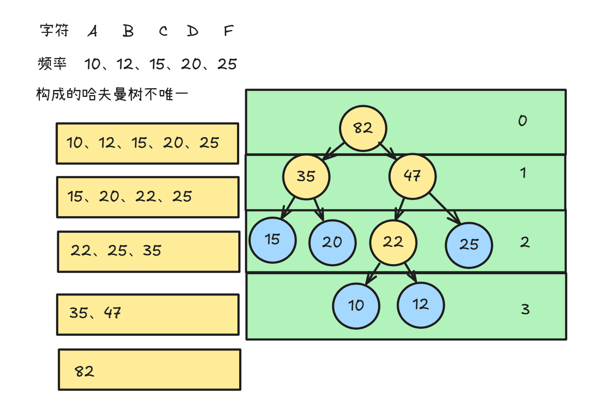
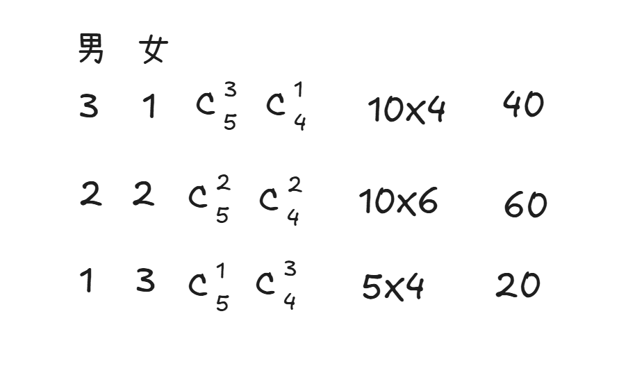
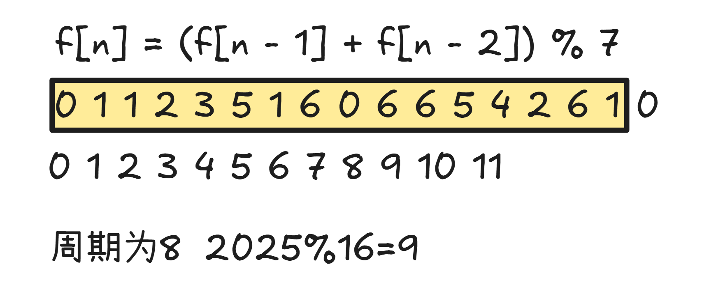
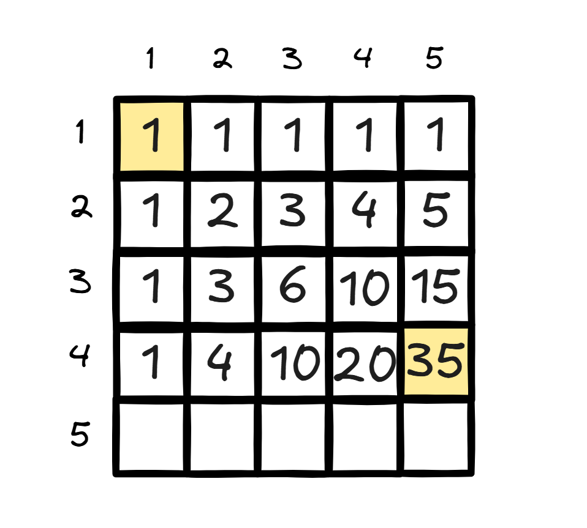
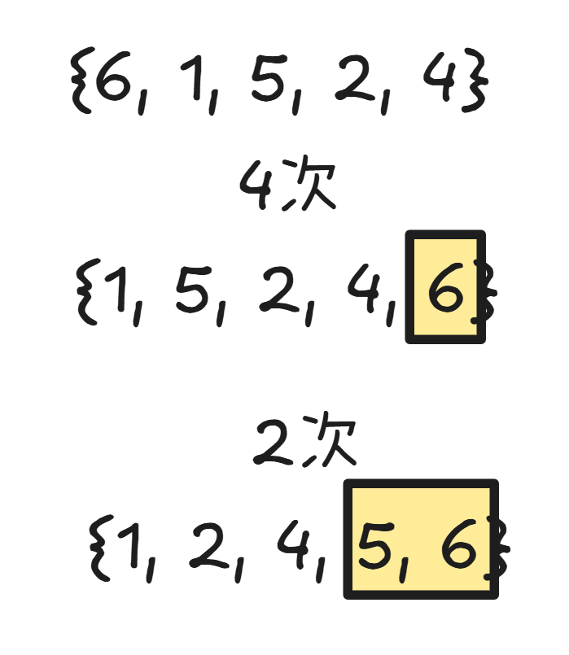
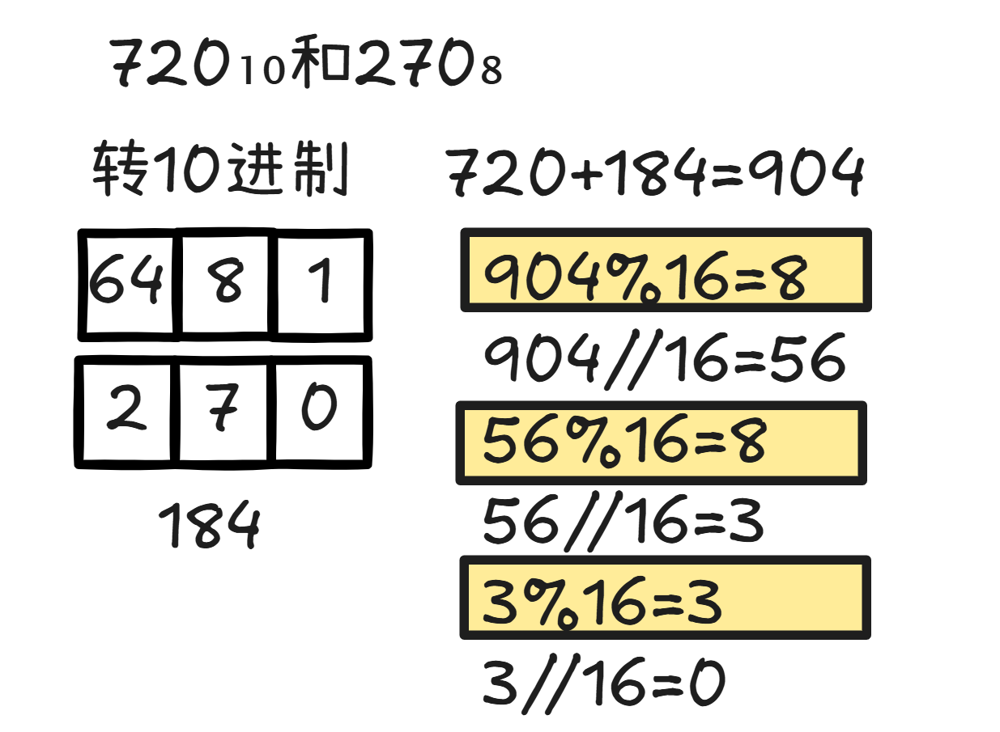

# CSP-J 2025

## 一、单项选择题（共15题，每题2分，共计30分）

**1.（2分）** 一个32位无符号整数可以表示的最大值，最接近下列哪个选项？（ ）
A. 4×10⁹
B. 3×10¹⁰
C. 2×10⁹
D. 2×10¹⁰

> 答案:A
>
> $-2^{31} \sim 2^{31}-1$        $2147483647$

**2.（2分）** 在C++中，执行 `int x = 255; cout << (x & (x - 1));` 后，输出的结果是？（ ）
A. 255
B. 254
C. 128
D. 0

> 答案:B
>
> 位运算

**3.（2分）** 函数 `calc(n)` 的定义如下，则 `calc(5)` 的返回值是多少？（ ）

```cpp
int calc(int n) {
    if (n <= 1) return 1;
    if (n % 2 == 0) return calc(n / 2) + 1;
    else return calc(n - 1) + calc(n - 2);
}
```

A. 5
B. 6
C. 7
D. 8

>答案:B

**4.（2分）** 用5个权值10、12、15、20、25构造哈夫曼树，该树的带权路径长度是多少？（ ）
A. 176
B. 186
C. 196
D. 206

>答案:B
>
>

**5.（2分）** 在一个有向图中，所有顶点的入度之和等于所有顶点的出度之和，这个总和等于？（ ）
A. 顶点数
B. 边数
C. 顶点数 + 边数
D. 顶点数 × 2

>答案:B

**6.（2分）** 从5位男生和4位女生中选出4人组成一个学习小组，要求学习小组中男生和女生都有。有多少种不同的选举方法？（ ）
A. 126
B. 121
C. 120
D. 100

> 答案:C
>
> 

**7.（2分）** 假设a，b，c都是布尔变量，逻辑表达式 `(a && b) || (!c && a)` 的值与下列哪个表达式不始终相等？（ ）
A. `a && (b || !c)`
B. `(a || !c) && (b || !c) && (a || a)`
C. `a && (!b || c)`
D. `!(!a || !b) || (a && !c)`

> 答案:C

**8.（2分）** 已知 `f[0] = 1`，`f[1] = 1`，并且对于所有 `n ≥ 2` 有 `f[n] = (f[n - 1] + f[n - 2]) % 7`。那么 `f[2025]` 的值是多少？（ ）
A. 2
B. 4
C. 5
D. 6

> 答案:D
>
> 

**9.（2分）** 下列关于C++ string类的说法，正确的是？（ ）
A. string对象的长度在创建后不能改变。
B. 可以使用 `+` 运算符直接连接一个string对象和一个char类型的字符。
C. string的 `length()` 和 `size()` 方法返回的值可能不同。
D. string对象必须以 `'\0'` 结尾，且这个结尾符计入 `length()`。

> 答案:B

**10.（2分）** 考虑以下C++函数：

```cpp
void solve(int &a, int b) {
    a = a + b;
    b = a - b;
    a = a - b;
}

int main() {
    int x = 5, y = 10;
    solve(x, y);
}
```

在main函数调用solve后，x和y的值分别是？（ ）
A. 5, 10
B. 10, 5
C. 10, 10
D. 5, 5

> 答案:C
>
> `solve`函数是交换函数，`&`地址引用，`solve(int a,int b)` 值传递

**11.（2分）** 一个8×8的棋盘，左上角坐标为(1,1)，右下角为(8,8)。一个机器人从(1,1)出发，每次只能向右或向下走一格。要到达(4,5)，有多少种不同的路径？（ ）
A. 20
B. 35
C. 56
D. 70

> 答案:B
>
> 坐标动态规划
>
> 

**12.（2分）** 某同学用冒泡排序对数组 `{6, 1, 5, 2, 4}` 进行升序排序，请问需要进行多少次元素交换？（ ）
A. 5
B. 6
C. 7
D. 8

> 答案:B
>
> 

**13.（2分）** 十进制数720₁₀和八进制数270₈的和用十六进制表示是多少？（ ）
A. 388₁₆
B. 3DE₁₆
C. 288₁₆
D. 990₁₆

> 答案:A
>
> 

**14.（2分）** 一棵包含1000个结点的完全二叉树，其叶子结点的数量是多少？（ ）
A. 499
B. 512
C. 500
D. 501

> 答案:C

**15.（2分）** 给定一个初始为空的整数栈S和一个空的队列P。我们按顺序处理输入的整数队列A：7, 5, 8, 3, 1, 4, 2。对于队列A中的每一个数，执行以下规则：如果该数是奇数，则将其压入栈S；如果该数是偶数，且栈S非空，则弹出一个栈顶元素，并加入到队列P的末尾；如果该数是偶数，且栈S为空，则不进行任何操作。当队列A中的所有数都处理完毕后，队列P的内容是什么？（ ）
A. 5, 1, 3
B. 7, 5, 3
C. 3, 1, 5
D. 5, 1, 3, 7

> 答案:A

---

## 二、阅读程序（程序输入不超过数组或字符串定义的范围；判断题正确填√，错误填×；除特殊说明外，判断题1.5分，选择题3分，共计40分）

### 第一题

```cpp
#include <algorithm>
#include <cstdio>
#include <cstring>

inline int gcd(int a, int b) {
    if (b == 0)
        return a;
    return gcd(b, a % b);
}

int main() {
    int n;
    scanf("%d", &n);
    int ans = 0;
    for (int i = 1; i <= n; ++i) {
        for (int j = i + 1; j <= n; ++j) {
            for (int k = j + 1; k <= n; ++k) {
                if (gcd(i, j) == 1 && gcd(j, k) == 1
                    && gcd(i, k) == 1) {
                    ++ans;
                }
            }
        }
    }
    printf("%d\n", ans);
    return 0;
}
```

#### 判断题

**16.（1分）** 当输入为2时，程序并不会执行第16行的判断语句。（ ）
A. 正确
B. 错误

**17.（1.5分）** 将第16行中的 `"&& gcd(i, k) == 1"` 删去不会影响程序运行结果。（ ）
A. 正确
B. 错误

**18.（1.5分）** 当输入的 `n ≥ 3` 的时候，程序总是输出一个正整数。（ ）
A. 正确
B. 错误

#### 单选题

**19.（3分）** 将第7行的 `"gcd(b, a % b)"` 改为 `"gcd(a, a % b)"` 后，程序可能出现的问题是（ ）。
A. 输出的答案大于原答案。
B. 输出的答案小于原答案。
C. 程序有可能陷入死循环。
D. 可能发生整型溢出问题。

**20.（3分）** 当输入为8的时候，输出为（ ）。
A. 37
B. 42
C. 35
D. 25

**21.（3分）** 调用 `gcd(36, 42)` 会返回（ ）。
A. 6
B. 252
C. 3
D. 2

---

### 第二题

```cpp
#include <algorithm>
#include <cstdio>
#include <cstring>
#define ll long long

int n, k;
int a[200007];
int ans[200007];

int main() {
    scanf("%d%d", &n, &k);
    for (int i = 1; i <= n; ++i) {
        scanf("%d", &a[i]);
    }
    std::sort(a + 1, a + n + 1);
    n = std::unique(a + 1, a + n + 1) - a - 1;
    for (int i = 1, j = 0; i <= n; ++i) {
        for (; j < i && a[i] - a[j + 1] > k; ++j)
            ;
        ans[i] = ans[j] + 1;
    }
    printf("%d\n", ans[n]);
    return 0;
}
```

#### 判断题

**22.（1.5分）** 当输入为 `"3 1 3 2 1"` 时，输出结果为2。（ ）
A. 正确
B. 错误

**23.（1.5分）** 假设输入的n为正整数，输出的答案一定小于等于n，大于等于1。（ ）
A. 正确
B. 错误

**24.（1.5分）** 将第14行的 `"n = std::unique(a + 1, a + n + 1) - a - 1;"` 删去后，有可能出现与原本代码不同的输出结果。（ ）
A. 正确
B. 错误

#### 单选题

**25.（3分）** 假设输入的a数组和k均为正整数，执行第18行代码时，一定满足的条件不包括（ ）。
A. `j <= i`
B. `a[i] - a[j] > k`
C. `j < n`
D. `a[j] < a[i]`

**26.（3分）** 当输入的 `n = 100`、`k = 2`、`a = {1, 2, ..., 100}` 时，输出为（ ）。
A. 34
B. 100
C. 50
D. 33

**27.（3分）** 假设输入的a数组和k均为正整数，但a数组不一定有序，则若误删去第13行的 `"std::sort(a + 1, a + n + 1);"`，程序有可能出现的问题有（ ）。
A. 输出的答案比原本答案更大
B. 输出的答案比原本答案更小
C. 出现死循环行为
D. 以上均可能发生

---

### 第三题

```cpp
#include <algorithm>
#include <cstdio>
#include <cstring>
#define ll long long

int f[5007][5007];
int a[5007], b[5007];
int n;

int main() {
    scanf("%d", &n);
    for (int i = 1; i <= n; ++i) {
        scanf("%d", &a[i]);
    }
    for (int i = 1; i <= n; ++i) {
        scanf("%d", &b[i]);
    }
    for (int i = 1; i <= n; ++i) {
        for (int j = 1; j <= n; ++j) {
            f[i][j] = std::max(f[i][j], std::max(f[i - 1][j], f[i][j - 1]));
            if (a[i] == b[j]) {
                f[i][j] = std::max(f[i][j], f[i - 1][j - 1] + 1);
            }
        }
    }
    printf("%d\n", f[n][n]);
    return 0;
}
```

#### 判断题

**28.（1.5分）** 当输入 `"4 1 2 3 4 1 3 2 2"` 时，输出为2。（ ）
A. 正确
B. 错误

**29.（1.5分）** 当程序运行完毕后，对于所有的 `1 ≤ i, j ≤ n`，都一定有 `f[i][j] <= f[n][n]`。（ ）
A. 正确
B. 错误

**30.（1.5分）** 将第18行的 `"f[i][j] = std::max(f[i][j], std::max(f[i - 1][j], f[i][j - 1]));"` 删去后，并不影响程序运行结果。（ ）
A. 正确
B. 错误

#### 单选题

**31.（3分）** 输出的答案满足的性质有（ ）。
A. 小于等于n
B. 大于等于0
C. 不一定大于等于1
D. 以上均是

**32.（3分）** 如果在第16行的循环前加上以下两行：`std::sort(a + 1, a + n + 1);` 和 `std::sort(b + 1, b + n + 1);`，则答案会（ ）。
A. 变大或不变
B. 变小或不变
C. 一定变大
D. 不变

**33.（3分）** 如果输入的 `a = {1, 2, ..., n}`，而且b数组中数字均为1~n中的正整数，则上述代码等价于下面哪个问题？（ ）
A. 求b数组去重后的长度
B. 求b数组的最长上升子序列
C. 求b数组的长度
D. 求b数组的最大值

---

## 三、完善程序（单选题，每小题3分，共计30分）

### 第一题（字符串解码）

"行程长度编码"（Run-Length Encoding）是一种无损压缩算法，常用于压缩重复字符较多的数据，以减少存储空间。假设原始字符串不包含数字字符。压缩规则如下：
i）如果原始字符串中一个字符连续出现N次（N≥2），在压缩字符串中它被表示为"字符+数字N"。例如，编码"A12"代表12个连续的字符A。
ii）如果原始字符串中一个字符只出现1次，在压缩字符串中它表示为该字符本身。例如，编码"B"代表1个字符B。

以下程序实现读取压缩字符串并输出其原始的、解压后的形式。试补全程序。

```cpp
#include <cctype>
#include <iostream>
#include <string>
using namespace std;

int main() {
    string z;
    cin >> z;
    string s = "";

    for (int i = 0; i < z.length(); ) {
        char ch = z[i];
        if (① && isdigit(z[i + 1])) {
            i++;
            int count = 0;
            while (i < z.length() && isdigit(z[i])) {
                count = ②;
                i++;
            }
            for (int j = 0; j < ③; ++j) {
                s += ch;
            }
        } else {
            s += ④;
            ⑤;
        }
    }

    cout << s << endl;
    return 0;
}
```

**33.（3分）** ①处应填（ ）
A. `i < z.length()`
B. `i - 1 >= 0`
C. `i + 1 < z.length()`
D. `isdigit(z[i])`

**34.（3分）** ②处应填（ ）
A. `count + (z[i] - '0')`
B. `count * 10 + (z[i] - '0')`
C. `z[i] - '0'`
D. `count + 1`

**35.（3分）** ③处应填（ ）
A. `count - 1`
B. `count`
C. 10
D. `z[i] - '0'`

**36.（3分）** ④处应填（ ）
A. `z[i + 1]`
B. `ch`
C. `z.back()`
D. `(char)z[i] + 1`

**37.（3分）** ⑤处应填（ ）
A. `i--`
B. `i = i + 2`
C. `i++`
D. `// 不执行任何操作`

---

### 第二题（精明与糊涂）

有N个人，分为两类：i）精明人：永远能正确判断其他人是精明还是糊涂；ii）糊涂人：判断不可靠，会给出随机的判断。已知精明人严格占据多数，即如果精明人有k个，则满足 `k > N / 2`。

你只能通过函数 `query(i, j)` 让第i个人判断第j个人：返回true表示判断结果为"精明人"；返回false表示判断结果为"糊涂人"。你的目标是，通过这些互相判断，找出至少一个百分之百能确定的精明人。同时，你无需关心 `query(i, j)` 的内部实现。

以下程序利用"精明人占多数"的优势。设想一个"消除"的过程，让人们互相判断并进行抵消。经过若干轮抵消后，最终留下的候选者必然属于多数派，即精明人。

例如，假设有三个人0、1、2。如果0说1是糊涂人，而1也说0是糊涂人，则0和1至少有一个是糊涂人。程序将同时淘汰0和1。由于三人里至少有两个精明人，我们确定2是精明人。

试补全程序。

```cpp
#include <iostream>
#include <vector>
using namespace std;

int N;
bool query(int i, int j);

int main() {
    cin >> N;

    int candidate = 0;
    int count = ①;

    for (int i = 1; i < N; ++i) {
        if (②) {
            candidate = i;
            count = 1;
        } else {
            if (③) {
                ④;
            } else {
                count++;
            }
        }
    }

    cout << ⑤ << endl;
    return 0;
}
```

**38.（3分）** ①处应填（ ）
A. 0
B. 1
C. N
D. -1

**39.（3分）** ②处应填（ ）
A. `count < 0`
B. `count == 1`
C. `count == 0`
D. `query(candidate, i) == false`

**40.（3分）** ③处应填（ ）
A. `query(candidate, i) == false`
B. `query(i, candidate) == true`
C. `query(candidate, i) == false && query(i, candidate) == false`
D. `query(candidate, i) == false || query(i, candidate) == false`

**41.（3分）** ④处应填（ ）
A. `count--`
B. `break`
C. `count++`
D. `candidate = i`

**42.（3分）** ⑤处应填（ ）
A. `N - 1`
B. `count`
C. `candidate`
D. 0

---

## 答案

### 答案速查表（单项选择题）

| 题号 | 1 | 2 | 3 | 4 | 5 | 6 | 7 | 8 | 9 | 10 | 11 | 12 | 13 | 14 | 15 |
|------|---|---|---|---|---|---|---|---|---|---|----|----|----|----|----|
| 答案 | A | B | B | B | B | C | C | D | B | C  | B  | B  | A  | C  | A  |

### 阅读程序1

| 16 | 17 | 18 | 19 | 20 | 21 |
|----|----|----|----|----|----|
| √  | ×  | √  | C  | A  | A  |

### 阅读程序2

| 22 | 23 | 24 | 25 | 26 | 27 |
|----|----|----|----|----|----|
| √  | √  | √  | B  | A  | D  |

### 阅读程序3

| 28 | 29 | 30 | 31 | 32 | 33 |
|----|----|----|----|----|----|
| √  | √  | ×  | D  | A  | B  |

### 完善程序1（字符串解码）

| 33 | 34 | 35 | 36 | 37 |
|----|----|----|----|----|
| C  | B  | B  | B  | C  |

### 完善程序2（精明与糊涂）

| 38 | 39 | 40 | 41 | 42 |
|----|----|----|----|----|
| B  | C  | D  | A  | C  |
